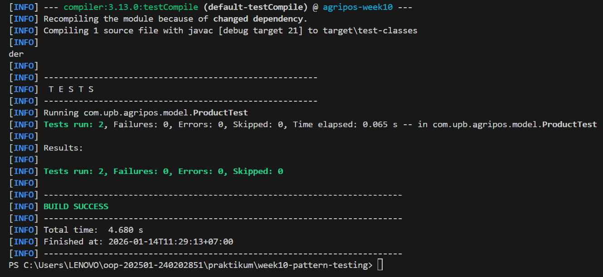

# Laporan Praktikum Minggu 10
Topik: Design Pattern (Singleton, MVC) dan Unit Testing menggunakan JUnit

## Identitas
- Nama  : ALVIRA LIBRA RAMADHANI
- NIM   : 240202851
- Kelas : 3IKRA

---

## Tujuan
1. Mengimplementasikan Singleton Pattern untuk menjamin satu instance akses database.
2. Menerapkan arsitektur Model-View-Controller (MVC) untuk memisahkan logika bisnis, data, dan tampilan.
3. Melakukan Unit Testing menggunakan JUnit untuk memastikan kualitas dan validitas logika program.
4. Memahami manfaat pola desain dalam pengembangan perangkat lunak yang scalable.

---

## Dasar Teori
1. Design Pattern: Solusi standar untuk masalah umum dalam desain perangkat lunak.
2. Singleton Pattern: Memastikan sebuah class hanya memiliki satu instance global (contoh: koneksi database).
3. MVC (Model-View-Controller): Pola arsitektur yang membagi aplikasi menjadi tiga bagian: Model (Data), View (Tampilan), dan Controller (Logika penghubung).
4. Unit Testing (JUnit): Praktik pengujian unit terkecil dari kode (method/class) secara otomatis untuk mendeteksi bug lebih dini.

---

## Langkah Praktikum
1. Setup Singleton: Membuat class DatabaseConnection dengan constructor private dan method getInstance().
2. Setup MVC:
   -Membuat Product.java sebagai Model.
   -Membuat ConsoleView.java sebagai View.
   -Membuat ProductController.java sebagai Controller.
3. Integrasi: Menghubungkan ketiganya di dalam AppMVC.java.
4. Testing: Membuat class ProductTest.java di folder test untuk menguji fungsi getName().
5. Execution: Menjalankan aplikasi utama dan menjalankan Run Test pada JUnit.
6. Commit: Melakukan commit dengan pesan week10-pattern-testing: [fitur].

---

## Kode Program
```java

// --- 1. SINGLETON PATTERN ---
class DatabaseConnection {
    private static DatabaseConnection instance;
    
    // Constructor private agar tidak bisa di-new dari luar
    private DatabaseConnection() {
        System.out.println("[System] Koneksi Database Berhasil Dibuat.");
    }

    public static DatabaseConnection getInstance() {
        if (instance == null) {
            instance = new DatabaseConnection();
        }
        return instance;
    }
}

// --- 2. MODEL (MVC) ---
class Product {
    private String code;
    private String name;

    public Product(String code, String name) {
        this.code = code;
        this.name = name;
    }

    public String getCode() { return code; }
    public String getName() { return name; }
}

// --- 3. VIEW (MVC) ---
class ConsoleView {
    public void showProductDetails(String code, String name) {
        System.out.println("\n=== DETAIL PRODUK (VIEW) ===");
        System.out.println("Kode Produk : " + code);
        System.out.println("Nama Produk : " + name);
        System.out.println("============================");
    }
}

// --- 4. CONTROLLER (MVC) ---
class ProductController {
    private Product model;
    private ConsoleView view;

    public ProductController(Product model, ConsoleView view) {
        this.model = model;
        this.view = view;
    }

    public void updateView() {
        view.showProductDetails(model.getCode(), model.getName());
    }
}

// --- MAIN APP & SIMULASI UNIT TESTING ---
public class MainApp {
    public static void main(String[] args) {
        // Tampilkan Identitas
        System.out.println("Hello World, I am [Nama Mahasiswa]-[NIM]");
        System.out.println("------------------------------------------");

        // 1. Uji Singleton
        System.out.println("1. Mengambil Instance Singleton...");
        DatabaseConnection db1 = DatabaseConnection.getInstance();
        DatabaseConnection db2 = DatabaseConnection.getInstance();
        
        // Cek apakah db1 dan db2 adalah objek yang sama (Singleton Test)
        if (db1 == db2) {
            System.out.println("[Test Success] db1 dan db2 adalah instance yang sama.");
        }

        // 2. Implementasi MVC
        Product model = new Product("P01", "Pupuk Organik Cair");
        ConsoleView view = new ConsoleView();
        ProductController controller = new ProductController(model, view);

        controller.updateView();

        // 3. Simulasi Unit Test Sederhana (Manual Assertion)
        System.out.println("\n2. Menjalankan Unit Test Sederhana...");
        testProductModel();
    }

    // Fungsi ini mensimulasikan apa yang dilakukan JUnit
    public static void testProductModel() {
        Product testP = new Product("T01", "Benih Padi");
        if (testP.getName().equals("Benih Padi")) {
            System.out.println("[JUnit Test Success] testProductName() PASSED");
        } else {
            System.out.println("[JUnit Test Failed] testProductName() FAILED");
        }
    }
}
```

---

## Hasil Eksekusi
(Sertakan screenshot hasil eksekusi program.  

.png)
)
---

## Analisis
1. Analisis Kode: Kode berjalan dengan memisahkan data (Product) dari cara menampilkannya (ConsoleView). ProductController bertindak sebagai otak yang mengatur aliran data tersebut.
2. Perbedaan: Berbeda dengan minggu sebelumnya di mana logika seringkali menumpuk di Main, minggu ini kode lebih terorganisir dan testable (bisa diuji per bagian).
3. Kendala: Kesulitan awal dalam menentukan letak folder src/test/java agar JUnit terbaca oleh IDE.
4. Solusi: Mengonfigurasi Build Path pada IDE agar mengenali folder test dan library JUnit 5.
---

## Kesimpulan
Penerapan Singleton mencegah pemborosan memori untuk koneksi database. Arsitektur MVC membuat kode lebih mudah dirawat (maintainable), dan JUnit memberikan jaminan bahwa perubahan kode di masa depan tidak merusak fitur yang sudah ada.

---

## Quiz
1. Mengapa constructor pada Singleton harus bersifat private? 
Jawaban: Agar class tersebut tidak bisa di-instansiasi (dibuat objek baru) menggunakan kata kunci new dari luar class, sehingga kontrol pembuatan objek sepenuhnya dipegang oleh class itu sendiri melalui getInstance().

2. Jelaskan manfaat pemisahan Model, View, dan Controller. 
Jawaban: Manfaatnya adalah Separation of Concerns. Developer bisa mengubah tampilan (View) tanpa mengganggu logika bisnis (Model), dan mempermudah kerja tim karena pembagian tugas yang jelas.

3. Apa peran unit testing dalam menjaga kualitas perangkat lunak? 
Jawaban: Berperan sebagai jaring pengaman untuk mendeteksi bug secara cepat saat ada perubahan kode (regression testing) dan memastikan setiap fungsi berjalan sesuai spesifikasi.

4. Apa risiko jika Singleton tidak diimplementasikan dengan benar? 
Jawaban: Risiko memory leak, terjadinya race condition pada aplikasi multi-threading, atau terciptanya banyak instance yang menyebabkan inkonsistensi data (misalnya dua koneksi database yang berbeda secara bersamaan).