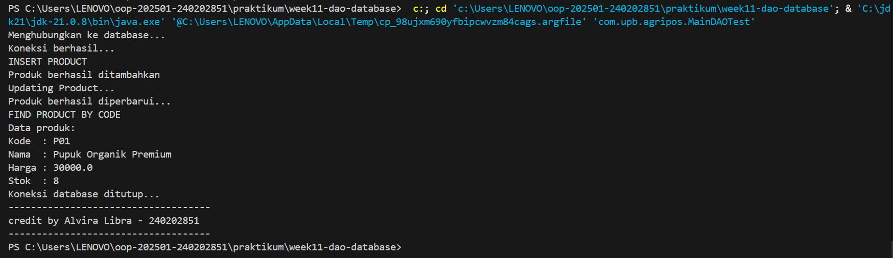

# Laporan Praktikum Minggu 11
Topik: [Tuliskan judul topik, misalnya "Class dan Object"]

## Identitas
- Nama  : Haidar Habibi Al Farisi
- NIM   : 240202862
- Kelas : 3IKRA

---

## Tujuan
(Tuliskan tujuan praktikum minggu ini.  
Contoh: *Mahasiswa memahami konsep class dan object serta dapat membuat class Produk dengan enkapsulasi.*)

---

## Dasar Teori
(Tuliskan ringkasan teori singkat (3–5 poin) yang mendasari praktikum.  
Contoh:  
1. Class adalah blueprint dari objek.  
2. Object adalah instansiasi dari class.  
3. Enkapsulasi digunakan untuk menyembunyikan data.)

---

## Langkah Praktikum
(Tujuan dari praktikum ini adalah:
1.Mahasiswa memahami konsep Data Access Object (DAO) dalam pemrograman berorientasi objek.
2. Mahasiswa mampu menghubungkan aplikasi Java dengan basis data menggunakan JDBC.
3. Mahasiswa dapat mengimplementasikan operasi CRUD (Create, Read, Update, Delete) pada database PostgreSQL
4.Mahasiswa mampu mengintegrasikan DAO dengan class aplikasi sesuai prinsip desain OOP yang baik.
week11-dao-database: implementasi DAO dan CRUD produk dengan JDBC

)

---

## Kode Program
(Tuliskan kode utama yang dibuat, contoh:  

```java
package com.upb.agripos;

import java.sql.Connection;
import java.sql.DriverManager;

import com.upb.agripos.dao.ProductDAO;
import com.upb.agripos.dao.ProductDAOImpl;
import com.upb.agripos.model.Product;

public class MainDAOTest {
    public static void main(String[] args) throws Exception {

        System.out.println("Database Conection...");
        Connection conn = DriverManager.getConnection(
            "jdbc:postgresql://localhost:5432/agripos",
            "postgres",
            "JERUKAGUNG"
        );
        System.out.println("Conection Success...");


        ProductDAO dao = new ProductDAOImpl(conn);

        // INSERT product
        System.out.println("Inserting Product...");
        Product p1 = new Product("P01", "Pupuk Organik", 25000, 10);
        dao.insert(p1);
        System.out.println("Produk berhasil ditambahkan");


        // UPDATE product
        System.out.println("Updating Product...");
        Product pUpdate = new Product("P01", "Pupuk Organik Premium", 30000, 8);
        dao.update(pUpdate);
        System.out.println("Produk berhasil diperbarui...");


        // SELECT PRODUCT BY CODE
        System.out.println("Finding Product by Code...");
        Product p = dao.findByCode("P01");
        if (p != null) {
            System.out.println("Data produk:");
            System.out.println("Kode  : " + p.getCode());
            System.out.println("Nama  : " + p.getName());
            System.out.println("Harga : " + p.getPrice());
            System.out.println("Stok  : " + p.getStock());
        } else {
            System.out.println("Produk Not Found");
        }
 

        // DELETE PRODUCT BY CODE
        System.out.println("Deleting Product...");
        dao.delete("P01");
        System.out.println("Produk berhasil dihapus");


        conn.close();
        // CONECTION CLOSED
        System.out.println("Conection Closed...");
        System.out.println("credit by Haidar Habibi Al Farisi - 240202862");
    }
}

```
)
---

## Hasil Eksekusi
(Sertakan screenshot hasil eksekusi program.  

)
---

## Analisis
(
- Program berjalan dengan memanfaatkan pola DAO untuk memisahkan akses database dari logika aplikasi.
- Class MainDAOTest hanya berfungsi sebagai penghubung dan penguji, tanpa berisi query SQL secara langsung.
- Dibandingkan praktikum sebelumnya, pendekatan ini lebih terstruktur karena menggunakan layer DAO.
-Kendala yang dihadapi adalah kesalahan koneksi database, yang diatasi dengan memastikan URL JDBC, username, dan password sudah benar.
)
---

## Kesimpulan
( kesimpulan dari praktikum minggu ini.  
Contoh: *Dengan menerapkan pola Data Access Object (DAO) dan JDBC, aplikasi Java menjadi lebih terstruktur, aman, dan mudah dikembangkan. Operasi CRUD dapat dijalankan secara terpisah dari logika utama aplikasi sehingga meningkatkan kualitas desain perangkat lunak.*)

---

## Quiz
(1. Apa fungsi utama DAO dalam aplikasi OOP?
   **Jawaban:**Memisahkan logika akses data dari logika bisnis agar kode lebih terstruktur dan mudah dipelihara.  

2. Mengapa PreparedStatement lebih disarankan dibanding Statement?
   **Jawaban:**Karena lebih aman dari SQL Injection dan meningkatkan performa query.  

3. Sebutkan operasi CRUD!  
   **Jawaban:**Create, Read, Update, dan Delete.  )
