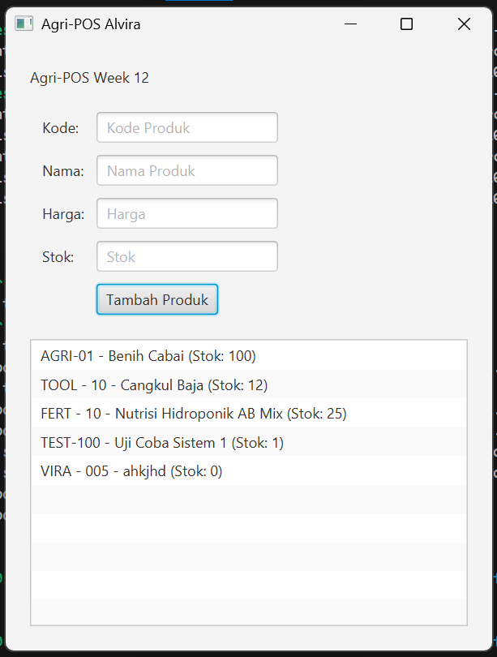

# Laporan Praktikum Minggu 12
Topik: GUI Dasar JavaFX (Event-Driven Programming)

## Identitas
- Nama  : ALVIRA LIBRA RAMADHANI
- NIM   : 240202851
- Kelas : 3IKRA

---

## Tujuan
1. Memahami konsep Event-Driven Programming pada JavaFX.
2. Membangun antarmuka grafis (GUI) sederhana untuk input data produk.
3. Mengintegrasikan GUI dengan backend (ProductService dan ProductDAO) yang telah dibuat sebelumnya.
4. Menerapkan prinsip DIP (Dependency Inversion Principle) di mana View tidak mengakses database secara langsung.

---

## Dasar Teori
1. JavaFX: Library Java untuk membangun aplikasi desktop dengan antarmuka grafis yang modern.
2. Event-Driven Programming: Paradigma pemrograman di mana alur program ditentukan oleh peristiwa (event) seperti klik tombol, penekanan keyboard, atau input pengguna.
3. Traceability: Kemampuan untuk menghubungkan implementasi kode dengan desain yang sudah dibuat di diagram UML (Bab 6).
4. Separation of Concerns: Memisahkan kode tampilan (View) dari kode logika bisnis (Service) dan kode akses data (DAO).

---

## Langkah Praktikum
1. Setup JavaFX: Mengonfigurasi library JavaFX pada proyek.
2. Pembuatan UI: Membuat layout menggunakan VBox atau GridPane yang berisi TextField untuk Kode, Nama, Harga, dan Stok.
3. Event Handling: Menambahkan .setOnAction pada tombol "Tambah Produk".
4. Integrasi Service: Menghubungkan tombol tersebut dengan method insert() pada ProductService.
5. Update Tampilan: Memastikan setelah data disimpan ke database, daftar di ListView juga diperbarui.
6. Dokumentasi: Mengisi tabel traceability dan push ke GitHub.

---

## Kode Program

```java
// Contoh Event Handler untuk tombol Tambah
btnAdd.setOnAction(event -> {
    try {
        Product p = new Product(
            txtCode.getText(),
            txtName.getText(),
            Double.parseDouble(txtPrice.getText()),
            Integer.parseInt(txtStock.getText())
        );
        
        // Memanggil Service (Bukan DAO Langsung!)
        productService.addProduct(p); 
        
        // Update List di Layar
        listView.getItems().add(p.getCode() + " - " + p.getName());
        
        // Bersihkan Form
        txtCode.clear(); txtName.clear();
    } catch (Exception e) {
        System.err.println("Error: " + e.getMessage());
    }
});
```

---

## Hasil Eksekusi 



---

## Analisis
1. Analisis Kode: Kode menggunakan pendekatan Event-Driven. Saat tombol diklik, program menjalankan fungsi validasi dan pengiriman data ke layer service.
2. Traceability: Implementasi ini sudah sesuai dengan Sequence Diagram di Bab 6, di mana urutannya adalah View -> Controller -> Service -> DAO -> Database.
3. Kendala: Mengatur tata letak (layouting) agar terlihat rapi dan menangani error input (misal harga diisi huruf).
4. Solusi: Menggunakan try-catch untuk menangkap NumberFormatException agar aplikasi tidak crash saat input tidak valid.
---

## Kesimpulan
Dengan JavaFX, aplikasi menjadi lebih interaktif. Pemisahan antara GUI dan Database melalui Service sangat penting agar kode mudah diuji dan dikembangkan tanpa merusak logika akses data yang sudah ada.
---


