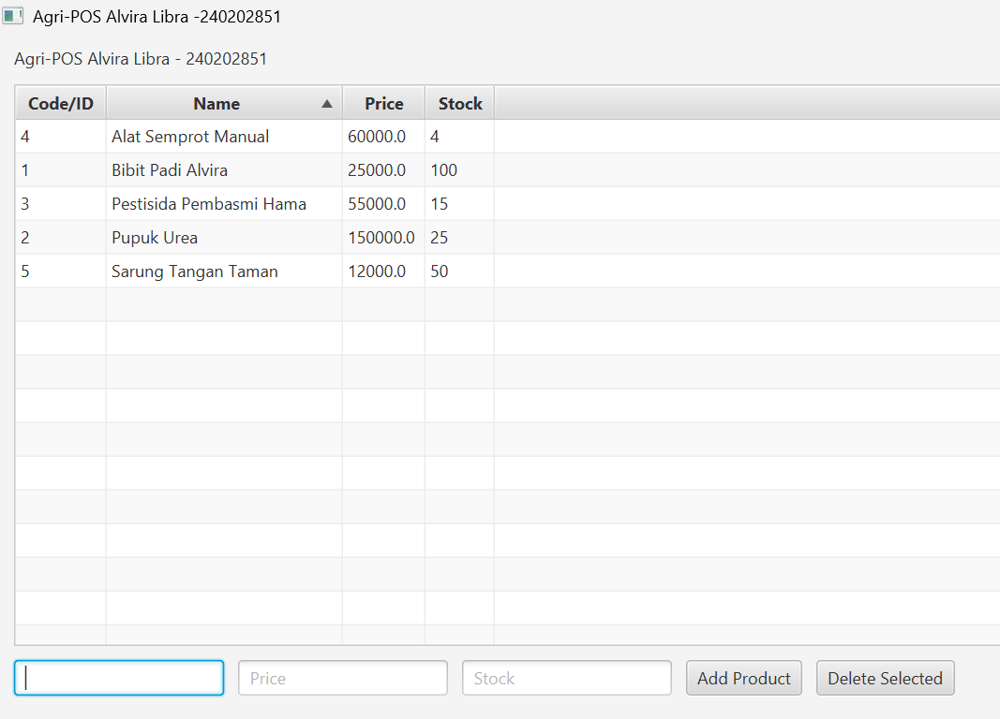

# Laporan Praktikum Minggu 13
Topik: GUI Lanjutan JavaFX (TableView dan Lambda Expression)

## Identitas
- Nama  : ALVIRA LIBRA RAMADHANI
- NIM   : 240202851
- Kelas : 3IKRA

---

## Tujuan
1. Mengimplementasikan TableView untuk menampilkan data dari database secara terstruktur.
2. Menggunakan Lambda Expression untuk menyederhanakan penulisan event handling.
3. Mengintegrasikan koleksi objek (ObservableList) dengan komponen GUI.
4. Memperkuat arsitektur aplikasi dengan memastikan ProductService dan ProductDAO terhubung penuh ke antarmuka pengguna.

---

## Dasar Teori
1. TableView: Kontrol JavaFX yang sangat kuat untuk menampilkan data dalam bentuk baris dan kolom.
2. Lambda Expression: Fitur Java (sejak Java 8) yang memungkinkan penulisan fungsi anonim secara ringkas, sering digunakan dalam event handling seperti setOnAction(e -> { ... }).
3. ObservableList: Koleksi khusus dari JavaFX yang memungkinkan UI untuk secara otomatis mendeteksi perubahan data (tambah/hapus) dan memperbarui tampilan secara real-time.
4. DIP (Dependency Inversion Principle): Prinsip di mana UI (High-level module) tidak bergantung pada Detail Database, melainkan pada abstraksi (Service/Interface).

---

## Langkah Praktikum
1. Peningkatan UI: Mengganti komponen ListView atau TextArea dari Week 12 menjadi TableView<Product>.
2. Konfigurasi Kolom: Mengatur TableColumn untuk memetakan atribut code, name, price, dan stock dari model Product.
3. Lambda Event Handling: Mengimplementasikan tombol "Hapus" menggunakan lambda untuk mengambil item terpilih (getSelectionModel().getSelectedItem()).
4. Fungsi loadData(): Membuat metode untuk mengambil semua data dari database via productService.findAll() dan memasukkannya ke dalam tabel.
5. Integrasi CRUD: Memastikan setiap aksi (Tambah/Hapus) diikuti dengan pemanggilan loadData() agar data di layar selalu sinkron dengan database.

---

## Kode Program

```java
// Contoh Inisialisasi TableView dan Lambda untuk Tombol Hapus
table.setItems(productList); // productList adalah ObservableList

btnDelete.setOnAction(e -> {
    Product selected = table.getSelectionModel().getSelectedItem();
    if (selected != null) {
        try {
            // Panggil service untuk hapus di DB
            productService.deleteProduct(selected.getCode());
            // Refresh tampilan
            loadData(); 
            System.out.println("Produk berhasil dihapus.");
        } catch (Exception ex) {
            ex.printStackTrace();
        }
    }
});
```

---

## Hasil Eksekusi
(Sertakan screenshot hasil eksekusi program.  


)
---

## Analisis
1. Analisis Kode: Penggunaan TableView membuat aplikasi jauh lebih informatif karena pengguna bisa melihat harga dan stok sekaligus. Lambda expression membuat kode Controller jauh lebih pendek dan mudah dibaca dibandingkan menggunakan Anonymous Inner Class.
2. Perbedaan: Jika di Week 12 tampilan hanya berupa teks sederhana, di Week 13 ini data sudah bersifat interaktif (bisa dipilih/seleksi) dan terhubung dua arah dengan database.
3. Kendala: Menghubungkan kolom tabel dengan properti class Product (biasanya memerlukan PropertyValueFactory).
4. Solusi: Memastikan class Product memiliki method getter yang sesuai standar Java Beans (misal: getCode()) agar PropertyValueFactory bisa membacanya secara otomatis.
---

## Kesimpulan
Aplikasi Agri-POS kini telah mencapai tahap fungsional yang lengkap. Dengan penggabungan DAO, Service, dan GUI yang menggunakan TableView, aplikasi sudah siap untuk diintegrasikan lebih lanjut ke tahap akhir (transaksi/keranjang belanja).

---

