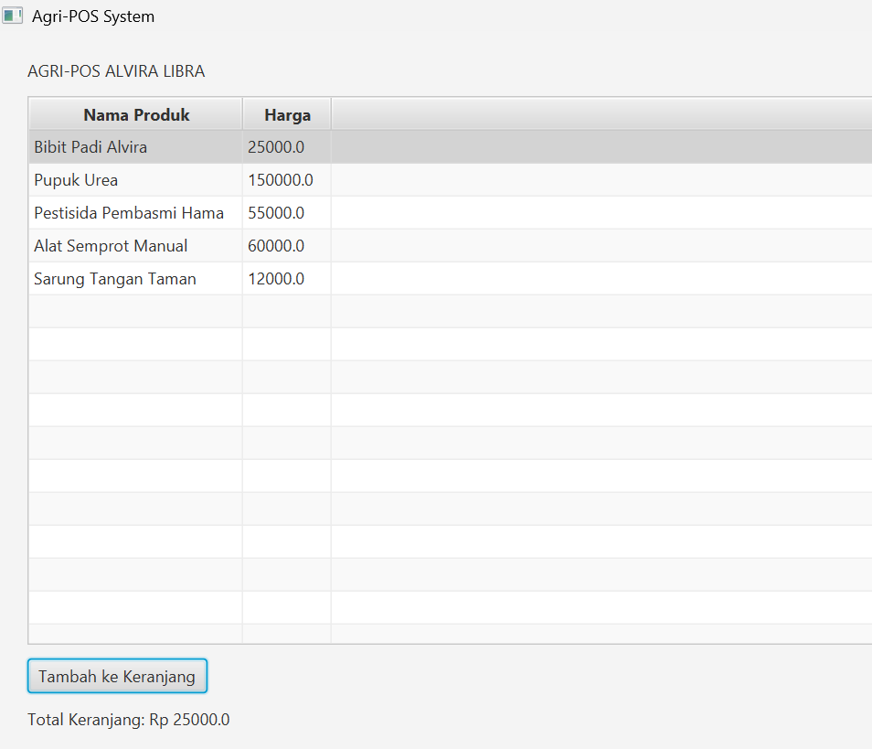
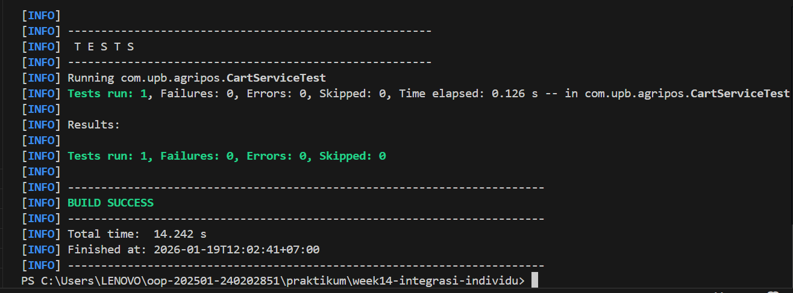
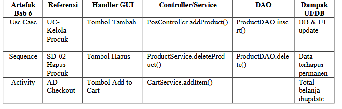

# Laporan Praktikum Minggu 14
Topik: Integrasi Individu (OOP + Database + GUI) - Agri-POS

## Identitas
- Nama  : ALVIRA LIBRA RAMADHANI
- NIM   : 240202851
- Kelas : 3IKRA

---

## Tujuan
1. Mengintegrasikan seluruh konsep OOP (Bab 1–13) ke dalam satu aplikasi Agri-POS yang utuh.
2. Mengimplementasikan rancangan UML dan prinsip SOLID dari Bab 6 ke dalam kode nyata.
4. Menghubungkan antarmuka JavaFX dengan database PostgreSQL melalui pola Service dan DAO.
5. Menerapkan pengujian unit (JUnit) dan penanganan pengecualian (Exception Handling) pada alur bisnis aplikasi.

---

## Dasar Teori
1. Integrasi End-to-End: Proses menggabungkan berbagai modul (GUI, Service, DAO, Database) menjadi satu kesatuan fungsional.
2. Dependency Inversion Principle (DIP): Prinsip SOLID di mana layer tinggi (View) tidak boleh bergantung langsung pada layer rendah (DAO), melainkan melalui abstraksi (Service).
3. Pola Desain Singleton: Digunakan untuk memastikan hanya ada satu instansi koneksi database yang digunakan di seluruh aplikasi.
4. Data Persistence: Penggunaan JDBC untuk memastikan data produk tersimpan secara permanen di PostgreSQL.

---

## Langkah Praktikum
1. Setup Struktur Project: Menggabungkan kode dari minggu-minggu sebelumnya ke dalam folder week14-integrasi-individu.
2. Implementasi Logic: Membuat class Cart dan CartService untuk menangani fitur keranjang belanja menggunakan Collections.
3. Koneksi Database: Memastikan JdbcProductDAO terhubung ke PostgreSQL dan menjalankan identitas diri di console.
4. Running & Testing: Menjalankan aplikasi JavaFX dan melakukan pengujian unit dengan JUnit.
5. Commit & Push: Mengunggah hasil kerja dengan pesan: week14-integrasi-individu: final integration Agri-POS

---

## Kode Program
```java
// Identitas di Console (Bab 1)
System.out.println("Hello World, I am ALVIRA LIBRA RAMADHANI-240202851"); [cite: 1]

// Integrasi Controller ke Service (DIP - Bab 14)
public void addToCart() {
    try {
        Product selected = tableView.getSelectionModel().getSelectedItem();
        cartService.addItem(selected, 1); // Menggunakan Collections 
        updateCartDisplay();
    } catch (Exception e) {
        AlertHandler.showError(e.getMessage()); // Exception Handling 
    }
}
```

---

## Hasil Eksekusi
(Sertakan screenshot hasil eksekusi program.  


)
---

## Analisis
1. Alur Kerja: Kode berjalan dengan memisahkan tanggung jawab (SRP). Saat tombol diklik di PosView, PosController akan memanggil ProductService yang kemudian berinteraksi dengan database via ProductDAO.
2. Perbedaan Pendekatan: Minggu ini menerapkan integrasi penuh. Jika sebelumnya fitur CRUD, GUI, dan Database diuji terpisah, sekarang semuanya bekerja dalam satu alur transaksi yang saling terikat.
3. Kendala & Solusi: Kendala utama adalah sinkronisasi antara data di database dan tampilan di TableView. Solusinya adalah membuat metode loadData() yang dipanggil secara otomatis setiap kali ada perubahan pada data (Insert/Delete).
---

## Kesimpulan
Dengan mengintegrasikan seluruh materi dari Bab 1 hingga 13, aplikasi Agri-POS menjadi sistem yang tangguh karena memiliki arsitektur yang terstruktur (MVC+Service+DAO), data yang permanen (PostgreSQL), dan logika yang teruji (JUnit).

---

## Tabel Traceability
